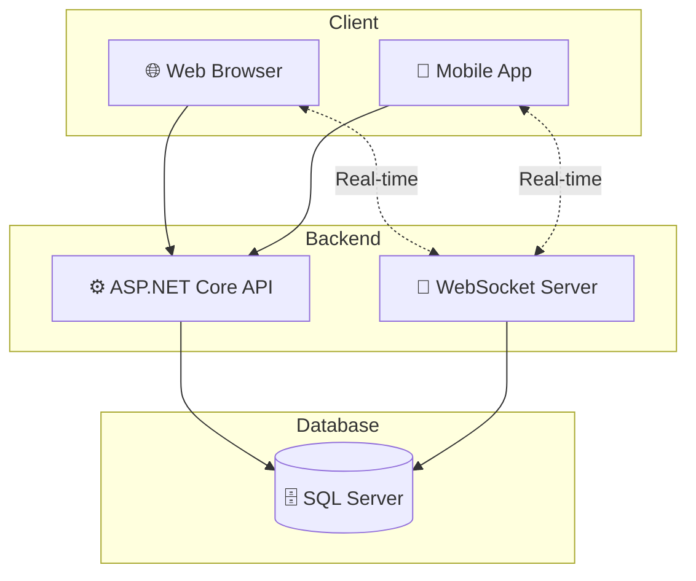

# 🎮 QUIZ GAME WEB

**🏆 Nền tảng game trắc nghiệm trực tuyến hiện đại với tính năng real-time và hệ thống xếp hạng**

---

## 📋 Giới thiệu

**QUIZ GAME WEB** là một ứng dụng web game trắc nghiệm được xây dựng trên nền tảng ASP.NET Core 8.0, cho phép người dùng tham gia các bài quiz đa dạng, thi đấu trực tuyến với nhau và theo dõi thành tích qua hệ thống xếp hạng.

---

## ✨ Tính năng chính

### 🎯 Dành cho Người dùng

| Tính năng | Mô tả |
|-----------|-------|
| 📝 **Quiz hàng ngày** | Tham gia các bài quiz được cập nhật mỗi ngày |
| 🎨 **Quiz tùy chỉnh** | Tạo và chơi quiz theo chủ đề yêu thích |
| 🤝 **Quiz chia sẻ** | Chia sẻ quiz với bạn bè và cộng đồng |
| ⚔️ **Chế độ đối kháng** | Thi đấu trực tuyến real-time với người chơi khác |
| 📊 **Lịch sử chơi** | Xem lại kết quả và phân tích các câu trả lời sai |
| 🏆 **Bảng xếp hạng** | Theo dõi thứ hạng và so sánh với người chơi khác |
| 🎁 **Phần thưởng & Thành tựu** | Nhận phần thưởng và mở khóa thành tựu |

### 👨‍💼 Dành cho Quản trị viên

| Tính năng | Mô tả |
|-----------|-------|
| 👥 **Quản lý người dùng** | Thêm, sửa, xóa và phân quyền người dùng |
| ❓ **Quản lý câu hỏi** | Tạo và quản lý kho câu hỏi đa dạng |
| 📚 **Quản lý chủ đề** | Phân loại câu hỏi theo chủ đề |
| ⚙️ **Quản lý độ khó** | Thiết lập các mức độ khó cho câu hỏi |
| 📅 **Quản lý Quiz ngày** | Lên lịch và quản lý quiz hàng ngày |
| 🏅 **Quản lý bảng xếp hạng** | Giám sát và điều chỉnh hệ thống xếp hạng |
| 🎖️ **Quản lý thành tựu** | Tạo và quản lý các thành tựu |
| 🎁 **Quản lý phần thưởng** | Thiết lập phần thưởng cho người chơi |
| 📈 **Thống kê & Báo cáo** | Xem báo cáo chi tiết hoạt động hệ thống |
| 🔑 **Quản lý vai trò** | Phân quyền và quản lý vai trò người dùng |

---

## 🛠️ Công nghệ sử dụng

### 💻 Backend
| Công nghệ | Mô tả |
|-----------|-------|
| **ASP.NET Core 8.0** | Framework chính |
| **Entity Framework Core 8.0** | ORM cho database |
| **SQL Server** | Cơ sở dữ liệu quan hệ |
| **JWT Bearer** | Xác thực và phân quyền |
| **WebSocket** | Giao tiếp real-time |
| **Swagger/OpenAPI** | Tài liệu API |

### 🎨 Frontend
| Công nghệ | Mô tả |
|-----------|-------|
| **ASP.NET MVC** | Web Framework |
| **HTML/CSS/JavaScript** | Giao diện người dùng |

---

## 🎯 Kiến trúc hệ thống

---

## 📄 License

Dự án được phát triển cho mục đích học tập.

---

**⭐ Nếu thấy hữu ích, hãy cho dự án một star nhé! ⭐**

Made with ❤️

